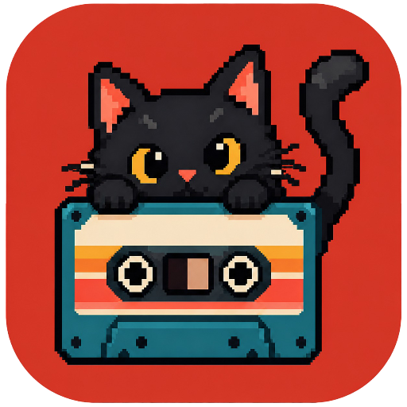
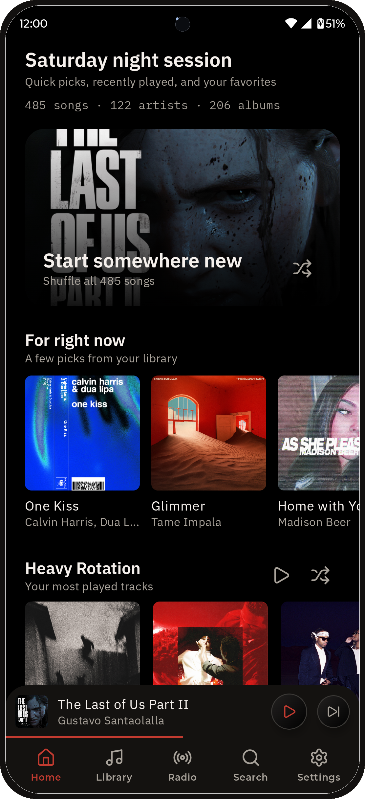
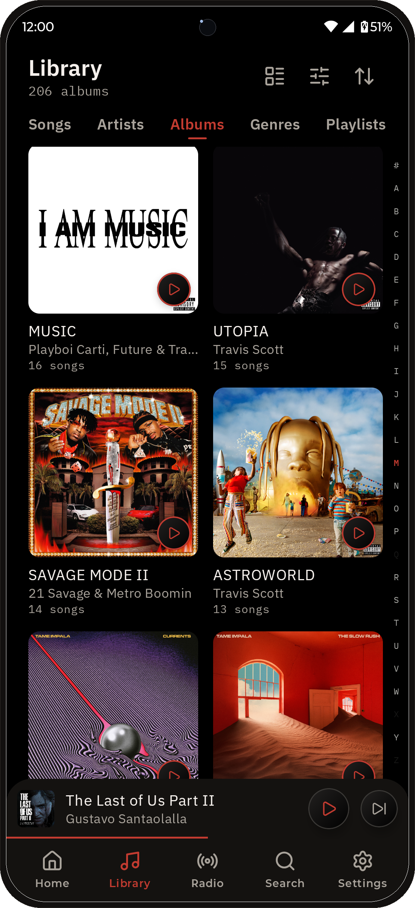
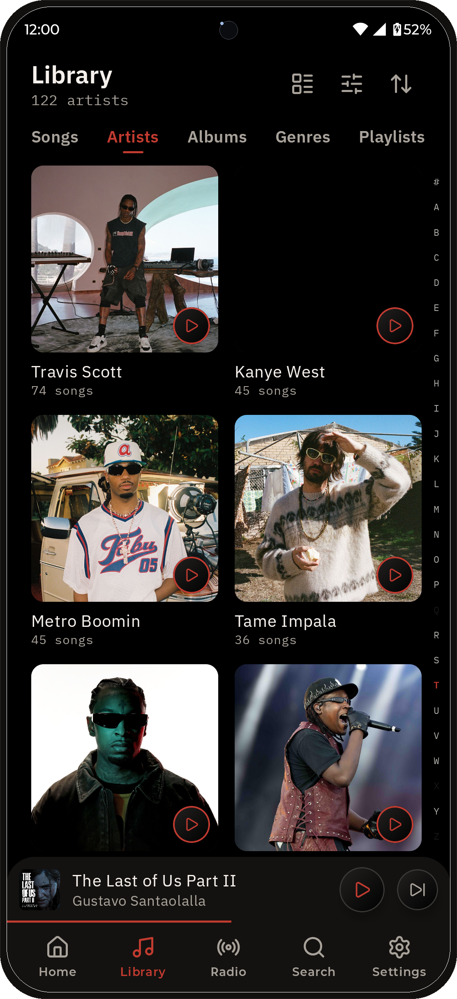
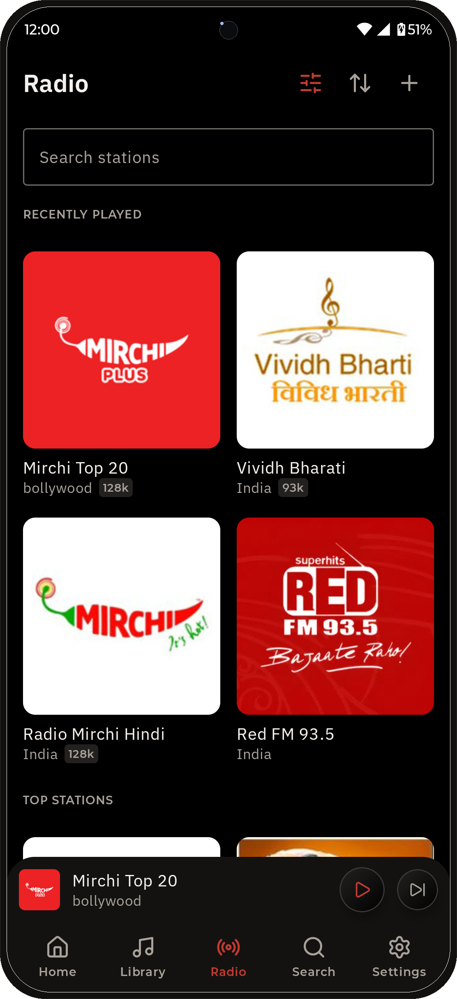
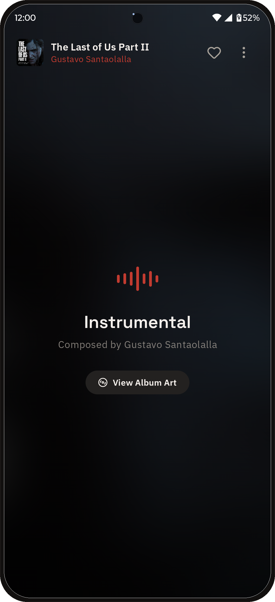
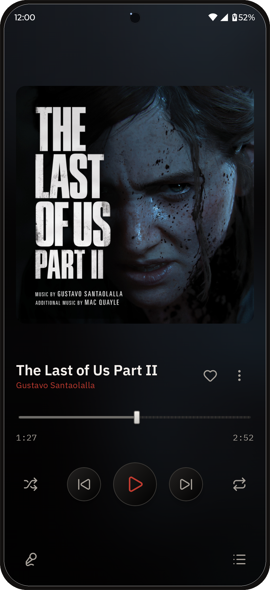
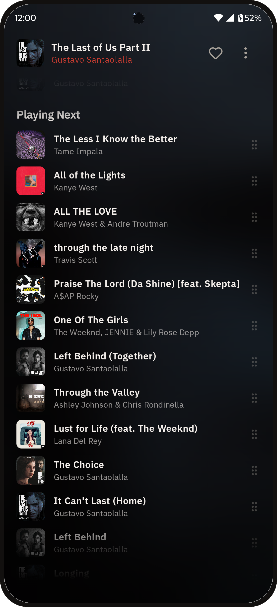
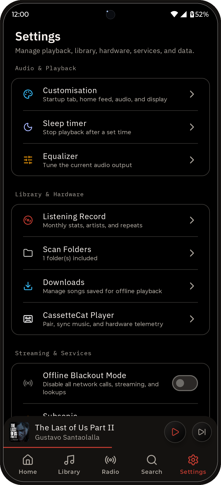

# CassetteCat

<p align="center">
  
</p>

<p align="center">
  <strong>A privacy-first Android music player for local media ownership and self-hosted streaming.</strong>
</p>

<p align="center">
  <a href="CHANGELOG.md"></a>
  <a href="LICENSE"></a>
  <a href="https://developer.android.com"></a>
  <a href="https://kotlinlang.org"></a>
  <a href="https://developer.android.com/jetpack/compose"></a>
  <a href="https://alternativeto.net/software/cassettecat/about/"></a>
  <a href="https://github.com/samyyy2311/CassetteCat/releases"></a>
</p>

---

## Install

<table align="center">
  <tr>
    <td align="center"><a href="https://play.google.com/store/apps/details?id=in.caffeinelabs.cassettecat"></a></td>
    <td align="center"><a href="https://github.com/samyyy2311/CassetteCat/releases/latest"></a></td>
    <td align="center"><a href="https://apps.obtainium.imranr.dev/redirect.html?r=obtainium://add/https://github.com/samyyy2311/CassetteCat"></a></td>
    <td align="center"></td>
    <td align="center"></td>
  </tr>
</table>

<p align="center">
  <strong>Android 8.0+</strong><br />
  Download the latest APK directly from GitHub or use Obtainium for automatic update tracking. F-Droid and OpenAPK listings are pending.
</p>

---

## Screenshots

<p align="center">
  
  
  
  
</p>
<p align="center">
  
  
  
  
</p>

---

## Features

### Audio & Playback

- **Media3 Playback Engine**: Background audio playback with lock screen
  controls, system media notifications, and state restoration on launch.
- **Hardware Equalizer & DSP**: 5-band graphic EQ, bass boost, virtualizer, and
  loudness enhancer. Includes calibrated headphone presets powered by
  [AutoEq](https://github.com/jaakkopasanen/AutoEq).
- **Volume Normalization (ReplayGain)**: Automatic track volume balancing to
  avoid sudden loudness spikes.
- **Volume Limit (Ear Protection)**: Optional hard cap on maximum output level,
  independent of system volume.
- **Synchronized Lyrics**: Real-time karaoke-style lyrics via
  [LRCLIB](https://lrclib.net), embedded ID3 tags, and local `.lrc` sidecars
  with configurable typography scaling and keep-screen-awake mode.
- **Sleep Timer & Smart Disconnect**: Sleep timer to pause playback, plus
  instant pause when headphones or Bluetooth disconnect.

### Library & Streaming

- **Local Audio Scanning**: Scans device audio with configurable folder
  whitelists, blacklists, and short audio clip filtering.
- **Tape Index Rail**: Industrial tactile A–Z fast scroller with an interactive
  HUD letter badge and haptic clock ticks for lightning-fast library browsing.
- **Smart Relevance Search**: Real-time multi-token relevance search matching
  across song titles, artists, and albums.
- **Subsonic API**: Connects to Navidrome, Gonic, and Airsonic with token
  authentication.
- **Jellyfin**: Direct streaming and music library browsing from your Jellyfin
  server, with Quick Connect sign-in support.
- **Internet Radio**: Search and browse tens of thousands of live stations from
  [Radio Browser](https://www.radio-browser.info) by name, tag, or country, with
  favorites and Android Auto support.
- **Offline Cache**: Download and cache streaming tracks for offline playback.
- **Scrobbling**: Track your listening on
  [ListenBrainz](https://listenbrainz.org) and [Libre.fm](https://libre.fm).
- **Listening Log**: Local playback statistics tracking your top tracks,
  artists, and albums.
- **Listening Room**: Sync playback with nearby devices over your local Wi-Fi.

### Planned Companion Hardware

> The companion protocol is present in the Android app, but the `firmware/`
> and `hardware/` directories currently contain design placeholders rather
> than buildable firmware or fabrication files.

- **Wireless Pairing**: Connect to a standalone ESP32 CassetteCat player over a
  direct SoftAP hotspot or your local Wi-Fi network via mDNS. On Android 13+,
  hotspot pairing associates automatically via `WifiNetworkSpecifier`.
- **Live Telemetry**: Battery level, charging status, SD card capacity, and
  firmware version, all from the Pairing screen.

### Device Integration

- **Android Auto & Android Automotive OS**: Browse your local library (Liked
  Songs, Playlists, Albums, Artists, All Songs) and control playback directly
  from the car.
- **Quick Settings Tile**: Play, pause, and see what's playing without opening
  the app.

### Design & Customization

- **Curated Theme Accents**: 6 dynamic color palettes: _Record Red_, _Cassette
  Amber_, _Electric Cyan_, _Neon Emerald_, _Tape Magenta_, and _Monochrome
  Silver_.
- **Pure Black AMOLED Mode**: Pitch black `#000000` surface backgrounds for true
  OLED blacks and maximum battery efficiency.
- **Now Playing & Artwork Styling**: Configurable album art corner radii (Curved
  16dp, Soft 8dp, Vinyl Square 0dp) and interactive remaining time countdown
  toggle (`-02:45`).
- **Navigation & Startup Preferences**: Configurable default landing screen
  (_Home_, _Library_, or _Last active tab_) and default Library section.
- **Ultra-HD Share Cards**: Export 2160×2700 poster cards for tracks and
  synchronized lyric excerpts.
- **Rewind**: Export your monthly listening stats as a shareable poster.
- **Home Screen Widget**: Control playback and view current song artwork
  directly from your home screen.

### Privacy

- Local-first architecture: no analytics, no third-party tracking, zero Google
  Play Services dependencies.
- Streaming server credentials encrypted with AES-256 via the hardware-backed
  `AndroidKeyStore`.
- Fully open source under GPL-3.0.
- F-Droid submission pending.

---

## Building

```bash
cd app
./gradlew assembleDebug
./gradlew testDebugUnitTest
```

Output:

```text
app/app/build/outputs/apk/debug/app-debug.apk
```

---

## Documentation

- [System Architecture](docs/architecture.md)
- [Android Development Guide](docs/android.md)
- [Troubleshooting & FAQs](docs/troubleshooting.md)
- [Privacy Policy](PRIVACY_POLICY.md)

---

## Contributing

Contributions are welcome.

See [CONTRIBUTING.md](CONTRIBUTING.md) for contribution guidelines, and [AI_DISCLOSURE.md](AI_DISCLOSURE.md) for how AI assistance is used in this project.

---

## Support

<p align="center">
  <a href="https://ko-fi.com/samyyy2311"></a>
  <a href="https://buymeacoffee.com/samyyy2311"></a>
</p>

---

## Credits

### Services & Data

- <a href="https://lrclib.net"></a>
  Synchronized and plain lyrics.
- <a href="https://coverartarchive.org"></a>
  Album artwork from MetaBrainz and the Internet Archive.
- <a href="https://musicbrainz.org"></a>
  Music metadata and encyclopedia.
- <a href="https://listenbrainz.org"></a>
  Open scrobbling.
- <a href="https://www.radio-browser.info"></a>
  Internet radio station directory.
- <a href="https://libre.fm"></a>
  Free software scrobbling (GNU FM).
- <a href="https://wikipedia.org"></a>
  Artist biographies (CC BY-SA 4.0).
- <a href="https://deezer.com"></a>
  <a href="https://theaudiodb.com"></a>
  Artist imagery and metadata.
- <a href="https://github.com"></a>
  Release update checks.

### Libraries & Design

- <a href="https://github.com/jaakkopasanen/AutoEq"></a>
  Headphone EQ profiles by Jaakko Pasanen.
- <a href="https://developer.android.com/media/media3"></a>
  Playback engine and caching.
- <a href="https://developer.android.com/jetpack/compose"></a>
  UI toolkit.
- <a href="https://lucide.dev"></a>
  App logo and icons (ISC).
- <a href="https://simpleicons.org"></a>
  Brand icons (CC0 1.0).
- <a href="https://github.com/square/okhttp"></a>
  HTTP client.
- <a href="https://github.com/IBM/plex"></a>
  Typefaces (OFL 1.1).
- <a href="https://github.com/floriankarsten/space-grotesk"></a>
  Display font by Florian Karsten (OFL 1.1).

---

## License

CassetteCat is licensed under the
[GNU General Public License v3.0 (GPL-3.0)](LICENSE).
